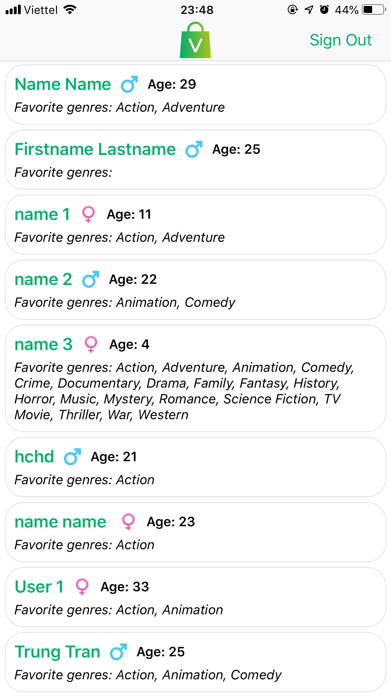

# SourceSage iOS Challenge - *VinSME*

**VinSME** is a app to allow user to sign up, sign in and browse the registered user list [Heroku API](https://radiant-dusk-57430.herokuapp.com).

Time spent: **30** hours spent in total

## Requirement

The following **required** functionality is completed:
- [x] Create an app with 3 screens: Sign Up, Sign In and Home
- [x] If user is logged in will show Home screen at first otherwise
show Sign In screen.
- [x] Use Swift to develop.
- [x] Can use storyboard, xib or code to create UI.
- [x] Can use any libraries.
- [x] You have 2 days to finish this test.

The following **optional** features are implemented:
- [x] Apply MVVM and Coordinator pattern
- [x] Use RxSwift

The following **additional** features are implemented:
- [x] User can pull to refresh at Home screen.
- [x] Validate user input as typing.

## Sign Up
- [x] Create sign up screen with 6 fields, sign up button and sign in button to navigate to sign in screen
- [x] Press sign up button -> show red text error below each field if it is empty or not matched with the requirements.
   - [x] If no validation error, call this API to register
   - [x] If fail will return response with status code 500 -> Show alert “There was a problem registering the user.”
   - [x] If success will return response with status code 200 -> Go to Home Screen

## Sign In
- [x] Create a login screen with 2 fields, sign in button and sign up button to navigate to sign up screen
- [x] Press sign in button -> show red text error below each field if it is empty.
- [x] If no validation error, call this API to sign in
   - [x] If fail will return response with status code 404 or 401 -> Show alert for 404 “No user found.”, 401 “Password is not correct”
   - [x] If success will return response with status code 200 -> Go to Home Screen

## Home
- [x] Create home screen with a tableView and a logout button on right navigation bar to log out to sign in screen
- [x] Show list of registered users with this API on TableView with dynamic height for each cell
- [x] Format CollectionViewCell
        {Name} {Gender Image} {Age}
        {Favourite Genres} (Show name of genre)
        
## How to extend the app:

1. [ ] User can sign in using OAuth login flow.
2. [ ] User can load more page once they reach the bottom of the feed using infinite loading.

## Video Walkthrough

Here's a walkthrough of implemented user stories:

**Sign Up:**

Sign Up - Step 1

Sign Up - Step 1 - Validation

Sign Up - Step 1 - Valid Input

Sign Up - Step 2 - Age Validation

Sign Up - Step 2 - Genre Validation

Sign Up - Step 2 - Valid Input

**Sign In:**

Sign In

Sign In - Validation

Sign In - Valid Input

**Home:**

## Notes

Describe any challenges encountered while building the app.

## License

Copyright [2019] [TRUNG]

Licensed under the Apache License, Version 2.0 (the "License");
you may not use this file except in compliance with the License.
You may obtain a copy of the License at

http://www.apache.org/licenses/LICENSE-2.0

Unless required by applicable law or agreed to in writing, software
distributed under the License is distributed on an "AS IS" BASIS,
WITHOUT WARRANTIES OR CONDITIONS OF ANY KIND, either express or implied.
See the License for the specific language governing permissions and
limitations under the License.
